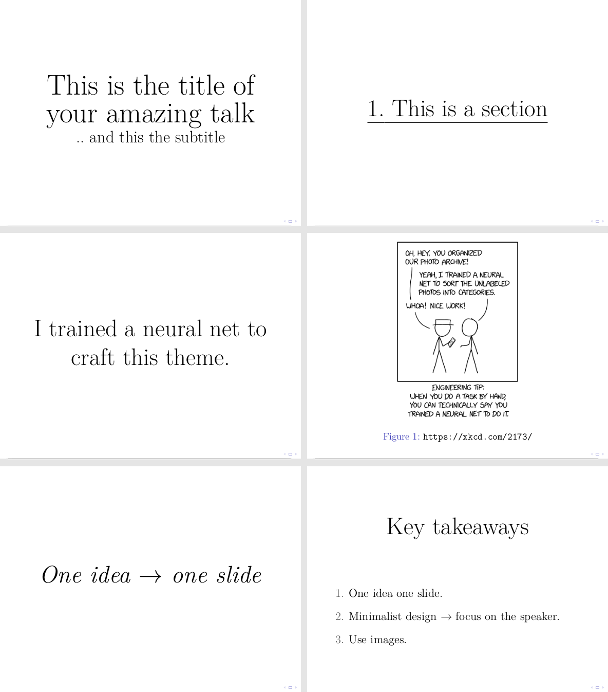

# Mi Theme

A minimalist LaTeX [`beamer`] presentation theme suited for talks and powerpoint haters crafted by a LaTeX newbie.
It follows the idea of absolute minimalism to avoid distraction and the “one idea one slide” philosophy.

## Look

## Usage

### Installation

1. Clone or just simply download [`beamerthememi.sty`].
2. Put [`beamerthememi.sty`] where your LaTeX compiler can find it (a path contained by `TEXINPUTS`). Usually the source root will do the job.
3. Insert `\usetheme{mi}` into your source file.

### Macros

| macro                                   | description                                             |
|-----------------------------------------|---------------------------------------------------------|
| `\mititle{text}`                        | Huge title. Use instead of frametitle for more control. |
| `\milarge{text}`                        | Large text. Could be used for subtitles.                |
| `\mifullimage[caption]{url}`            | The image fills the entire frame.                       |
| `\mifullwidthimage[caption]{url}`       | The image fills the entire width of the frame.          |
| `\mifullheightimage[caption]{url}`      | The image fills the entire height of the frame.         |
| `\micenter{content}`                    | Vertically centering and reduce frame margins           |
| `\misection[name in toc]{section name}` | Creates an underlined section slide                     |

| shorthand                               | translation                                          |
|-----------------------------------------|------------------------------------------------------|
| `\begin{miframe} content \end{miframe}` | `\begin{frame}\micenter{content}\end{frame}`         |
| `\mitextframe{text}`                    | `\begin{miframe}\mititle{content}\end{miframe}`      |
| `\miimageframe[caption]{url}`           | `\begin{frame}\mifullimage[caption]{url}\end{frame}` |

### Examples

Take a look in [`examples/`]. To build the examples using the provided Makefile you will need [`latexmk`].

[`beamer`]: <https://github.com/josephwright/beamer>
[`beamerthememi.sty`]: beamerthememi.sty
[`examples/`]: examples/
[`latexmk`]: <https://github.com/debian-tex/latexmk>
